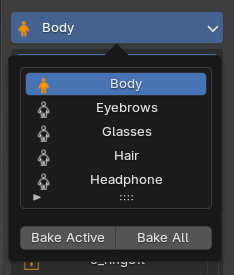

# **Bake Layer Data to Blender Native**

<figure markdown>

</figure>

Click Current Bind Mesh to open a dropdown list showing all bind meshes in the scene.

- Orange icon: The model has been initialized with Super Skin Pro.

- Default icon: The model uses native Blender data.

Click Bake Active / Bake All : Bake all layer results back to native Blender.

**Notes:**

- Once baked, all layers will be merged. If you want to keep them, you can [Export Weight](object_tools.md#weight-export) first or don't bake. You can still share the unbaked file with anyone, even if they don't have this add-on.

- If you continue skinning using native Blender without baking, returning to the add-on tools will overwrite your changes with the last saved add-on state.