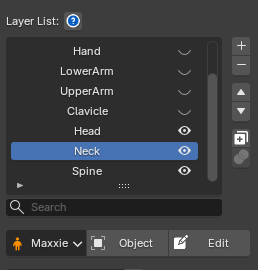

# Bone List

<figure markdown>

</figure>

**Bone List**

Shows the Deform Bone list, with a Lock/Unlock button for each bone to keep it from having its weight taken over while in Edit Weight Mode.

---

**Filter**

A single cycle button switches which bones are shown; clicking it steps between the two states below (the button lights up when Influence is active):

- Show All shows every bone.

- Influence shows only bones that carry weight, plus any orphaned bones (old vertex groups whose bone may have been deleted or renamed). See how to handle Orphaned Bone.

---

**Clipboard Bone Weight**

Clipboard the whole weight of the current Bone.

---

**Notes**

- While in Edit Weight Mode, you can select the bone to edit directly from this list, or by clicking it in the Viewport. [How to select a Bone via the Viewport](bone_picker.md)
- Supports `Ctrl` or `Shift` to select multiple entries at once.
- The Search Bar supports both plain search and Wildcard Search, e.g. `arm*` matches names starting with "arm", `arm*_L` matches names starting with "arm" and ending with "_L".

 
- - -
  

# **Layer List**

<figure markdown>

</figure>

The Layer List shows every Layer used in that model's Skin Weight.

You can delete, add, reorder, duplicate, rename, merge, and toggle each Layer on/off.

Each Layer has its own Weight Mask, which determines which area of the model that Layer affects.

You can edit a Layer's Mask while in weight-editing mode. Read more about Toggle Layer Mask Edit at [Weight Apply Operation](operation.md#toggle-layer-mask-edit-mode)
