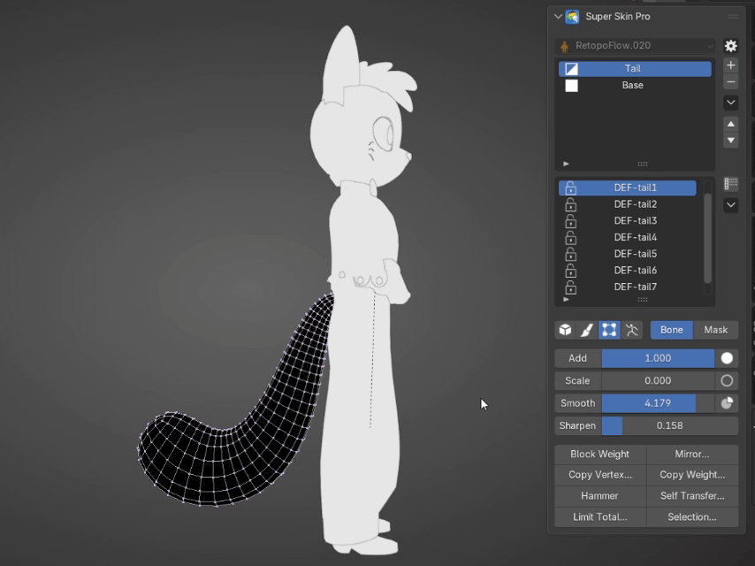
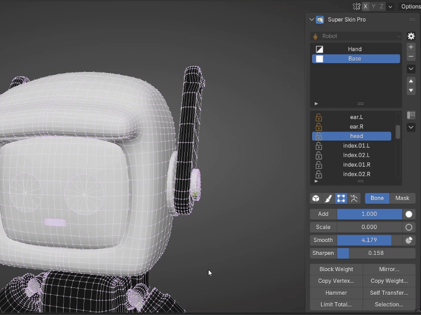

# Paint Weight Tools

<figure markdown>
 
</figure>

### Weight Apply Slider

  <iframe 
    src="https://www.youtube.com/embed/n2bP1M5w_TI" 
    style="position: absolute; top: 0; left: 0; width: 100%; height: 100%; border: 0;" 
    allow="accelerometer; autoplay; clipboard-write; encrypted-media; gyroscope; picture-in-picture; web-share" 
    allowfullscreen>
  </iframe>

Used to choose which tool to Paint Weight with — Brush Paint or Vertex Selection. The main Skin Weight operations are:
- Add Weight
- Scale Weight
- Smooth Weight
- Sharpen Weight

- - -

### Mirror Weight

  <iframe 
    src="https://www.youtube.com/embed/3bBY6CPEP9I" 
    style="position: absolute; top: 0; left: 0; width: 100%; height: 100%; border: 0;" 
    allow="accelerometer; autoplay; clipboard-write; encrypted-media; gyroscope; picture-in-picture; web-share" 
    allowfullscreen>
  </iframe>

Mirrors the weight of the Layer selected in the [Layer List](bone_list.md#layer-list), with the following additional settings:

- **Mirror Axis and Mirror Direction :** sets the World Axis used as the reference.
- **Mirror Target Data :** sets whether to mirror only the Layer Mask or the Bone Weight (both by default).
- **Mapping Keywords :** a list of Wildcard Keywords that identify left and right in the bone Naming Convention.

**Notes :**

1. You can select multiple layers in the Layer List to apply mirror weights across all of them.
2. If you have selected vertices while mirroring, the mirror will only apply to the selected vertices.

- - -

### Block Weight

<figure markdown>

</figure>

Automatically calculates weights from the selected bones as follows:

1. Select the bones you want to auto-assign.
2. Click the Block Weight button.

**Note :** Block Weight pulls weight from Bones that are not Locked, so check your Bone Locks carefully for a correct Block Weight result.

- - -

### Self Transfer

Transfers weight from a Vertex within the same Mesh, as follows:

1. Select the Vertex to use as the Source, press **Self Transfer...**, then press **Mark Source** in the popup
2. Select the target Vertex (Target), press **Self Transfer...** again, then press **Transfer** in the popup

- - -

### Copy Vertex Weight

Clipboard a Bone Weight or Mask Weight value, as follows:

1. Select a single Vertex, press **Copy Vertex...**, then press **Copy Vertex** in the popup
2. Select any number of destination Vertices, press **Copy Vertex...** again, then press **Paste Vertex** in the popup

- - -

### Hammer Weight

Click the Hammer button to hammer selected vertices to average their weights.

<figure markdown>
 
</figure>

- - -

### Multi-Color Preview

Press Alt + 3 to toggle Multi-Color Preview.

Note: Multi-Color mode may impact performance.