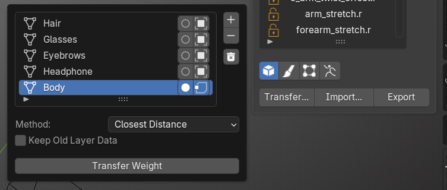
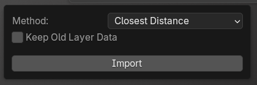
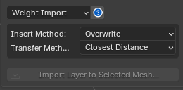

### Weight Transfer

<figure markdown>

</figure>

Weight Transfer is a tool that transfers weight from one model to multiple other models.

The Weight Transfer window has the following components:

<figure markdown>

</figure>

## 1. List of Models to Transfer Weight

- You can add or remove selected models from the list.

- The Toggle Is Source button at the end of the row marks that model as the Source for the weight transfer — every other model becomes a Target automatically.

- The Used Selected Vertices Only button at the end of the row limits the scope of the transfer to only the selected Vertices (select Vertices in Edit Mode).

## 2. Transfer Setting

- Keep Old Layer Data: if the Target Model already has Layers, leaving this unchecked (default) replaces all Layers, while checking it adds the new Layers instead, keeping the old ones.

- Transfer Method: Closest Distance transfers weight based on distance (default). Vertex Id transfers weight based on Vertex Id (this won't work if the Source and Target models don't have the same vertex count).

 
- - -
  

# Weight Export

<figure markdown>

</figure>

You can export all the Layer Data and Skin Weight from a selected Mesh to a file, for backing up a version or sending to someone else.

**How to Export**

1. Select the Mesh you want
2. Export Weights to JSON...

 
- - -
  

# Weight Import

<figure markdown>

</figure>

**You can Import Layer Data as follows:**

1. Select the model you want

2. Press Import Layer to Selected Mesh...

There are additional Import options:

**Insert Method :**

- Overwrite: replaces all Layer data with the imported data (default).

- Append: adds the Layers in, keeping all existing Layers.

**Transfer Method :**

- Closest Distance: transfers data based on the closest distance (default).

- Vertex ID: transfers data based on Vertex ID (import won't work if the Mesh's vertex count doesn't match the imported file).
