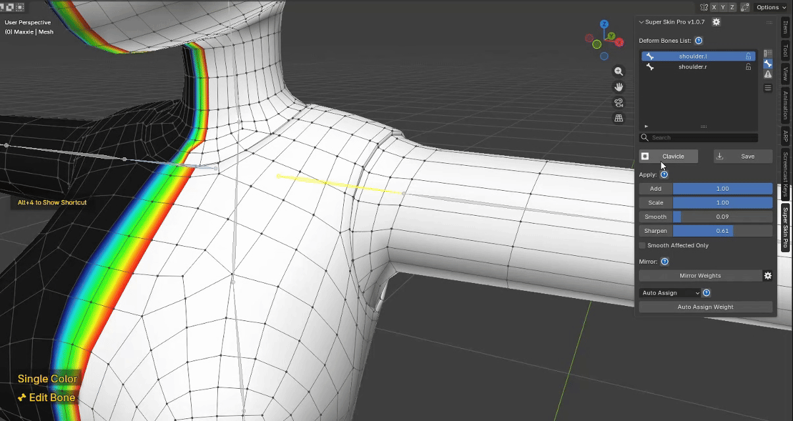
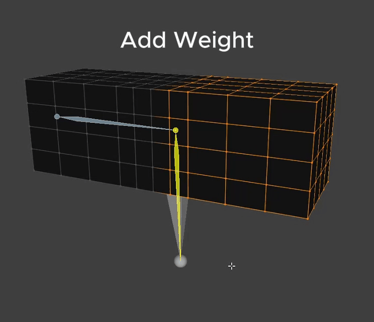
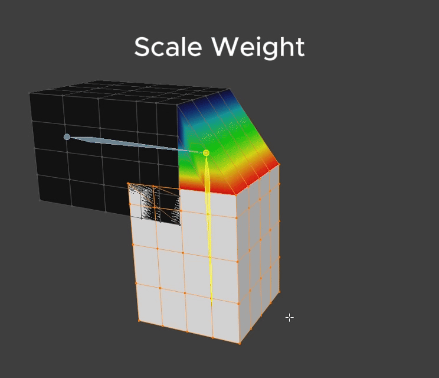
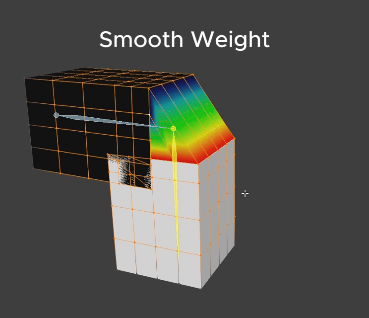
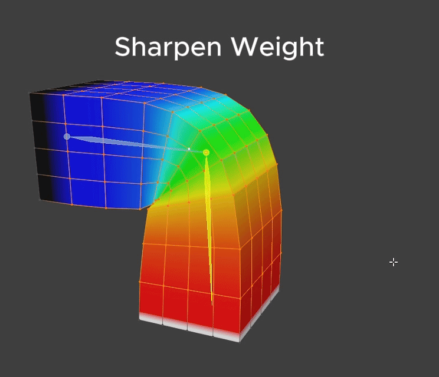

# Weight Apply Operation

---

## Toggle Layer Mask Edit Mode

<figure markdown>

</figure>

Every weight edit has its own Mask.

You can toggle it on/off and edit it via the button, or with the `Alt + 1` shortcut.

Notice the status label at the bottom-left changes from "Edit Bone" to "Edit Layer Mask" once you enter Mask editing mode.

Note: every Apply Weight tool works exactly as normal for editing a Layer's Mask too!

 
 
---
 
 

**Apply Weight**

<figure markdown>

</figure>

The Apply Weight UI has a slider plus buttons for each Apply Weight tool: Add Weight, Scale Weight, Smooth Weight, Sharpen Weight. You can apply weight through the UI or with a shortcut — details below.

### **1. Add Weight**

<figure markdown>

</figure>

**Effect**
- Add Weight adds weight according to the Intensity value.
- The value ranges 0-1, and works additively: Weight Value + Add Value

**How to use**

- Select only the vertices you want to edit.
- If nothing is selected, Add Weight applies to the whole mesh.
- Via shortcut: hold `Alt + Left Click` and drag right to adjust the Add Weight value.
- Via UI: adjust the slider, then press the Add Weight button.

**Notes**

- You can Lock a Bone to keep it from being affected by Apply Weight.
- After applying weight, whether via UI or shortcut, a popup appears at the bottom-left letting you further adjust the value after the fact.

 
 

### **2. Scale Weight**

<figure markdown>

</figure>

**Effect**

- Scale Weight reduces the Intensity of the weight.
- The value ranges 0-1 and works multiplicatively: Weight Value * Scale Value
- At 1: no effect happens, since multiplying by 1 always gives back the same value.
- At 0.5: intensity is reduced by half.
- At 0: intensity is reduced all the way to 0.

**How to use**

- Select only the vertices you want to edit.
- If nothing is selected, Scale Weight applies to the whole mesh.
- Via shortcut: hold `Alt + Left Click` and drag left to adjust the Scale Weight value.
- Via UI: adjust the slider, then press the Scale Weight button.

**Notes**

- You can Lock a Bone to keep it from being affected by Apply Weight.
- After applying weight, whether via UI or shortcut, a popup appears at the bottom-left letting you further adjust the value after the fact.

 
 

### **3. Smooth Weight**

<figure markdown>

</figure>

**Effect**

- Smooths weight so it blends closer to its surrounding neighbors.
- The value ranges 0-10.

**How to use**

- Select only the vertices you want to edit.
- If nothing is selected, Smooth Weight applies to the whole mesh.
- Via shortcut: hold `Alt + Right Click` and drag right to adjust the Smooth Weight value.
- Via UI: adjust the slider, then press the Smooth Weight button.

**Notes**

- When **Smooth Affected Only** is checked, smoothing is limited to only the area that has previously been smoothed.
- You can Lock a Bone to keep it from being affected by Apply Weight.
- After applying weight, whether via UI or shortcut, a popup appears at the bottom-left letting you further adjust the value after the fact.

 
 

### **4. Sharpen Weight**

<figure markdown>

</figure>

**Effect**

- Makes weight values diverge more sharply and strongly from their surroundings.
- The value ranges 0-10.

**How to use**

- Select only the vertices you want to edit.
- If nothing is selected, Sharpen Weight applies to the whole mesh.
- Via shortcut: hold `Alt + Right Click` and drag left to adjust the Sharpen Weight value.
- Via UI: adjust the slider, then press the Sharpen Weight button.

**Notes**

- You can Lock a Bone to keep it from being affected by Apply Weight.
- After applying weight, whether via UI or shortcut, a popup appears at the bottom-left letting you further adjust the value after the fact.
---
