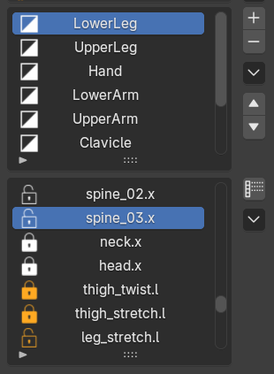

You can watch a quick tutorial on [Super Skin Pro Tutorials Playlist](https://www.youtube.com/playlist?list=PLe-1umuorC5Q)

<figure markdown>

</figure>

In the next section below, we’ll take an in-depth look at the interface and its features.

# Interface Overview

<figure markdown>

</figure>

**Active Bind Mesh**

Displays the currently selected mesh. You can bake its layer data via [Bake Layer Data to Blender Native](bindmesh.md)
- - -

**Mode Toggle**

Quick buttons for switching between

- Object Mode
- Paint Weight (Brush)
- Paint Weight (Vertex)
- Pose modes.

- - -

### Layer & Bone List

<figure markdown="span">
  
</figure>

#### Layer List (Top)

Displays all skin weight layers. You can add, delete, reorder, duplicate, merge, and toggle the visibility of each layer. [Watch Layer Tutorial](https://youtu.be/PYMJwbvAdoY)

* **Enable / Disable:** Toggle layer activation by clicking the icon in front of the layer item.
* **Rename:** Double-click the layer name to rename it.

#### Bone List (Bottom)

Displays the active deform bones for the selected layer.

* **Lock / Unlock:** Click the lock icon in front of any bone to prevent [weight bleeding](https://youtu.be/B4HqxA83n0k).
* **Focus Viewport:** Double-click a bone to focus on it in the 3D viewport.
* **Filter Influenced Bones:** Toggle via the button in the right menu to display only bones with weights.

In Weight Paint Mode, instead of selecting bones from the list, you can [select bones in the viewport.](bone_picker.md)

#### Useful Shortcuts

In the bone and layer list, you can use the following shortcuts:

* <kbd>Ctrl</kbd> + <kbd>Click</kbd>: Add or remove items individually
* <kbd>Shift</kbd> + <kbd>Click</kbd>: Select a range of items
* <kbd>Ctrl</kbd> + <kbd>A</kbd> or <kbd>Alt</kbd> + <kbd>Shift</kbd> + <kbd>Click</kbd> : Select all items in the list.
* <kbd>Ctrl</kbd> + <kbd>I</kbd>: Invert selection

- - -

### Object Mode Tools

For more details, see [Object Mode Tools](object_tools.md).

<figure markdown>
  
</figure>

---

### Weight Paint Mode Tools

For more details, see [Weight Paint Mode Tools](edit_tools.md).

<figure markdown>
  
</figure>