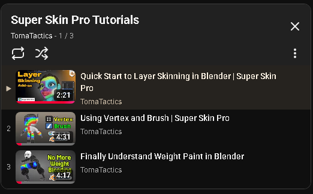
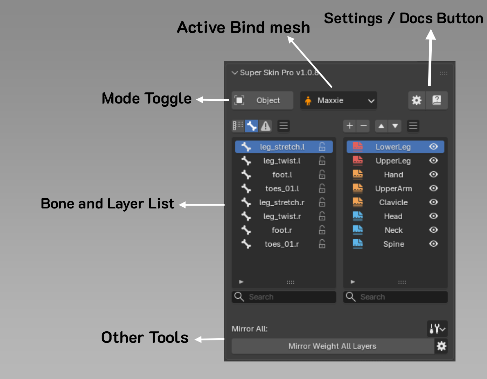
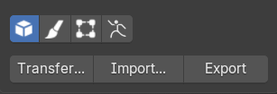
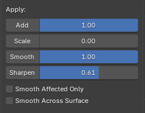

You can watch a quick tutorial on [Super Skin Pro Tutorials Playlist](https://www.youtube.com/playlist?list=PLe-1umuorC5Q)

<figure markdown>

</figure>

In the next section below, we’ll take an in-depth look at the interface and its features.

# Interface Overview

<figure markdown>

</figure>

**Active Bind Mesh**

Displays the currently selected mesh. You can bake its layer data via [Bake Layer Data to Blender Native](bindmesh.md)
- - -

**Mode Toggle**

Quick buttons for switching between

- Object Mode
- Paint Weight (Brush)
- Paint Weight (Vertex)
- Pose modes.

- - -

**Bone & Layer List**

The Bone List includes a Lock/Unlock toggle for each bone to prevent its weights from being altered or stolen while in Edit Weight Mode.

The Layer List displays all layers used in the model's skin weights. You can add, delete, reorder, duplicate, rename, merge, and toggle the visibility of each layer. Each layer also has its own weight mask, which you can modify using the Edit Tools.

Notes:

- While in Edit Weight Mode, you can select bones directly from this list or by clicking them in the viewport with [Select bones in viewport](bone_picker.md)

In the bone and layer list, you can use the following shortcuts:

- Ctrl or Shift and Select : Select multiple items

- Ctrl + A: Select all items

- Ctrl + I: Invert selection

- - -

### Object Mode Tools

For more details, see [Object Mode Tools](object_tools.md).

<figure markdown>
  
</figure>

---

### Weight Paint Mode Tools

For more details, see [Weight Paint Mode Tools](edit_tools.md).

<figure markdown>
  
</figure>